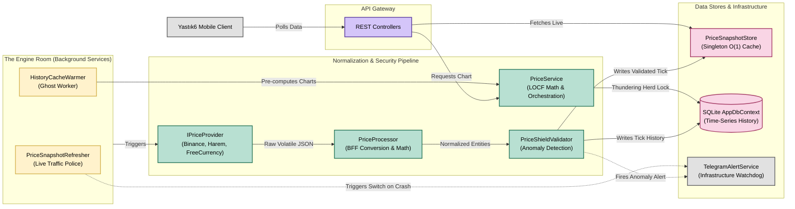

# Yastık6 Backend – Component Architecture & Execution Pipeline (C4 Level 3)

**Status:** Architectural Specification & Internal Component Design
**Scope:** .NET 10 Stateless BFF Pipeline (`Yastık6.Api`)

---

## 1. Executive Summary

The Yastık6 backend is engineered not as a traditional CRUD REST API, but as a highly resilient, stateless **Backend-For-Frontend (BFF) normalization pipeline**. Its primary directive is to insulate the client-side local fortress from the extreme volatility of external financial markets. By utilizing preemptive RAM caching, deterministic algorithms (LOCF), and active anomaly blocking, the backend guarantees high-throughput O(1) response times while remaining entirely unburdened by client state or user identity.

## 2. API Component Architecture (C4 Level 3)

---

## 3. The Engine Room: Background Workers

To ensure zero-latency client responses, external data fetching is strictly decoupled from client HTTP requests.

*   **`PriceSnapshotRefresher` (The Traffic Police):** An infinite loop running on a background thread that continuously polls primary providers (Harem, Binance, FreeCurrency). It acts as the system's active heartbeat.
    *   **Smart Fallback Switch:** If a primary provider crashes, the Refresher automatically routes traffic to the bench (e.g., `BinanceClient` -> `YahooCryptoClient`). 
    *   **DDoS Quarantine:** If a provider fails completely, the loop imposes a strict 5-minute quarantine penalty (`Task.Delay(TimeSpan.FromMinutes(5))`) to prevent resource exhaustion and upstream API bans.
*   **`HistoryCacheWarmer` (The Ghost Worker):** A background daemon that pre-computes dense chart datasets (Day, Week, Month, Year). It stages these massive queries into RAM before the user ever opens the application, ensuring heavy SQLite aggregations never block the main thread.

---

## 4. Normalization & Security Pipeline

All external data is treated as hostile and untrusted. Before updating the immutable `PriceRecord` entities, data must survive a multi-stage validation pipeline.

*   **BFF `PriceProcessor`:** Centralizes cross-currency logic. Crypto assets are dynamically converted to TRY utilizing the pre-cached `USDTRY=X` rate before hitting the database, offloading heavy multi-currency processing from the constrained mobile client.
*   **`PriceShieldValidator`:** The ultimate gatekeeper against upstream data corruption.
    *   **Shield 1 (Zero-Price):** Rejects payload instantly if Ask/Bid is `<= 0`.
    *   **Shield 2 (Flash Crash):** Rejects payload if the instant deviation exceeds `40%`.
    *   **Smart Muting:** Uses an `AlertTracker` cache key to prevent Telegram alert spam, muting identical errors for 1 hour while the system silently falls back to the last known valid price.

---

## 5. Algorithmic Integrity & Concurrency

### The LOCF (Last Observation Carried Forward) Algorithm
Located within the `PriceService`, the charting engine handles sparse time-series data using a strict mathematical fill-forward approach. To prevent "time-travel" data corruption, the algorithm requires an absolute historical anchor. If a price point is unknown in the past, the timeline remains mathematically sparse until a true data point is intercepted, strictly preventing the projection of future data into historical gaps.

### Concurrency Protection (Thundering Herd Prevention)
If the `HistoryCacheWarmer` misses a cache hit and 5,000 users simultaneously request a 1-year chart, it would execute 5,000 identical heavy SQLite queries, crashing the container. The `PriceService` implements a strict `SemaphoreSlim(1, 1)` lock. 
*   **Execution:** Only the very first request is allowed to hit the database. All concurrent requests wait at the lock. Once the first request completes and populates the RAM cache, the lock releases, and all waiting requests are instantly served the exact same memory pointer, neutralizing the Thundering Herd phenomenon.
