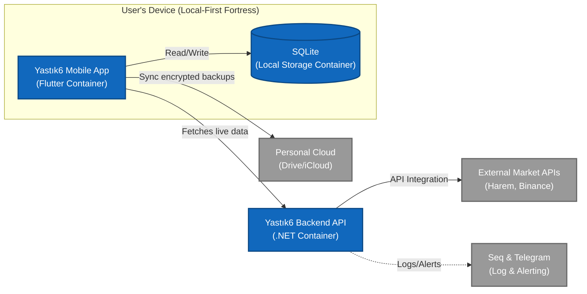

# Yastık6 – Architectural Blueprint
**Status:** Architectural Design & Systems Thinking Showcase

## 1. Executive Summary
Yastık6 is a privacy-first, local-first personal finance system engineered for absolute data sovereignty. Unlike conventional finance apps that centralize user portfolios, Yastık6 localizes all sensitive data within the device’s "Local-First Fortress." Our backend operates as a **stateless BFF (Backend-For-Frontend) pipeline**, offloading complex market data normalization and historical computations from the client. This strategy preserves client-side resources—ensuring fluid performance on constrained devices—while transforming volatile external data into **immutable domain entities**. Our client-side logic performs deterministic PnL calculations on this normalized stream, ensuring total financial accuracy without ever exposing user state to the server.

> **▶ Watch the Architecture in Action:** [Link to 60-Second Video Demo / Loom]

## 2. System Architecture (C4 Level 2)

### Key Architectural Boundaries:

* **The Client Fortress:** The mobile app and local database operate as an isolated unit. All sensitive user data is encrypted at rest using device-bound keys.
* **Stateless BFF Gateway:** The .NET API acts as a normalized gateway to external market data. To prevent unauthorized resource exhaustion, the API enforces **Shared-Secret Authentication**. The client uses a pre-provisioned, device-resident secret to sign requests, allowing the backend to validate legitimate client traffic while remaining strictly stateless and anonymous regarding the user's personal identity.
* **Encrypted Synchronization:** Cloud providers are treated as "dumb" storage blobs for encrypted backups, ensuring that the cloud never interacts with raw user data.

## 3. Engineering Philosophy & Constraints

**Privacy-by-Design over Centralized Convenience**  
Yastık6 operates under a strict constraint: user financial data is a liability, not an asset. By intentionally rejecting the standard "User Account + Cloud DB" paradigm, the system guarantees absolute privacy. This limitation forced the engineering of resilient local solutions—such as device-bound encryption and raw blob cloud backups—proving that data sovereignty does not have to compromise user experience.

**The Stateless BFF (Backend-For-Frontend) Trade-off**  
Direct connections to diverse external financial APIs create brittle mobile applications. The .NET 10 backend serves as a "blind" processing pipeline. It standardizes volatile market data and absorbs rate-limit impacts, delivering a clean data stream to the client. The backend utilizes shared-secret authentication to validate legitimate traffic while retaining zero state regarding user identity.

**Deterministic Accuracy and the Single Source of Truth**  
Financial applications cannot tolerate eventual consistency or rounding errors. To ensure Portfolio and Profit/Loss (PnL) calculations are exactly reproducible, the local device is established as the immutable single source of truth. Calculations are strictly executed client-side against normalized data streams, guaranteeing that offline states and historical audits remain perfectly intact.

## 4. Core Architectural Patterns

**Load Mitigation & Client-Server Contract**  
To protect backend resources and guarantee sub-second response times, the system strictly prohibits user-driven, on-demand market data fetches. Instead, background workers continuously normalize and warm a backend memory cache. The client simply polls this optimized cache at set intervals. This decouples UI interactions from backend compute cycles, preventing server resource exhaustion and upstream API rate limits.

**Provider Strategy & Interface Segregation (Backend)**  
To insulate the core domain from external volatility, the backend employs a strict Provider Strategy. External data sources (e.g., Binance, Yahoo Finance, Harem) are isolated behind standard interfaces. If a third-party API changes its response structure or deprecates an endpoint, the system’s core business logic remains entirely untouched.

**Immutable Domain Entities (Client-Side)**  
Raw, volatile external data is never allowed to directly touch the UI or the local persistence layers. Data traversing the network is immediately mapped into stable, immutable domain entities. This enforces a rigorous boundary where the application only operates on validated, predictable objects, drastically reducing runtime exceptions and data-binding bugs.

---

<b>▶ 5. Client-Side Architecture (Flutter)</b> <i>(Click to expand)</i>

 

Because the backend is strictly stateless, the Flutter client must operate as its own self-contained engine. It handles complex data orchestration, raw SQLite migrations, and deterministic financial calculations without relying on cloud compute.

**Concurrent State Orchestration (Riverpod)**  
The application utilizes Riverpod to separate business logic from the UI. The `_dbMasterProvider` executes parallel `Future.wait` requests to the SQLite engine, merging transaction histories, realized profits, and asset allocations simultaneously. This local data state is then seamlessly merged with the asynchronous `livePriceProvider` polling the .NET backend, producing a unified, reactive `PortfolioSnapshot` without blocking the main thread or causing UI jank.

**Strict Mathematical Precision**  
Floating-point arithmetic (`double`) introduces rounding errors that are unacceptable in financial tracking. The domain layer utilizes the `Decimal` package for all cost-basis, PnL, and percentage calculations. Whether the user is viewing their total net worth or a single lot's realized profit, the math is executed with infinite-precision rational numbers.

**Domain-to-UI Mappers**  
The widget tree is kept entirely "dumb." Complex business entities (`AssetPosition`, `Transaction`) are never passed directly to UI components. Instead, a `UniversalPortfolioMapper` intercepts the domain models and converts them into strictly formatted `LotUiModel` and `PortfolioDonutModel` objects. This enforces a rigorous separation of concerns, allowing UI components like the `UniversalAssetPickerSheet` to remain entirely modular and reusable across different asset classes.

<b>▶ 6. Design Decisions Log</b> <i>(Click to expand)</i>

 

| Decision | Alternative Considered | Why I Chose This |
| :--- | :--- | :--- |
| **O(1) Memory Cache Endpoint** | Direct DB / API Fetching | **Extreme Scalability:** The backend `GetMarketOverview` endpoint has zero database interactions. Background workers continuously warm an in-memory `_store`. Client requests are served directly from RAM, allowing a single container to handle thousands of concurrent users. |
| **Decimal Precision Math** | Standard `double` types | **Financial Accuracy:** Floating-point math introduces rounding errors. The client-side valuator uses the `Decimal` package, converting values to rational numbers for exact cost-basis and Profit/Loss calculations. |
| **Raw SQL & Bulk Ops via EF Core** | Dapper / Standard EF Tracking | **Zero-Allocation Performance:** To handle millions of time-series records, the backend bypasses EF Core's state tracker. Using `.AsNoTracking()`, bulk `ExecuteDeleteAsync()` in chunks, and `SqlQueryRaw` provides micro-ORM performance. |
| **Raw SQLite Migrations** | ORM Auto-Migrations | **Data Sovereignty:** Because user data lives only on the device, a failed local migration is catastrophic. Table schema upgrades (e.g., v2 to v3) are handled via explicit, transactional `CREATE TABLE ... AS SELECT` SQL commands to guarantee zero data loss. |

<b>▶ 7. Hard Problems & System Challenges</b> <i>(Click to expand)</i>

 

**1. Defending Against Upstream Data Corruption (The Price Shield)**  
When aggregating external APIs, the system is vulnerable to upstream glitches and zero-price anomalies. If bad data reaches the client, it destroys the user's portfolio PnL. The backend utilizes an intelligent `PriceShieldValidator` that intercepts provider data. If it detects a sudden deviation (>40%) or a corrupted zero-value, it automatically rejects the payload, falls back to the last known valid price, and fires a throttled Telegram alert. On the client side, the `PortfolioValuator` provides a secondary shield, instantly falling back to the local database's `currentPrice` if the live stream drops.

**2. The FIFO Sequence Paradox (Time-Travel Prevention)**  
Yastık6 allows users to retroactively edit past transactions. However, if a user attempts to change the date of a 'Buy' transaction to a date *after* a linked 'Sell' transaction, it creates a sequence paradox that breaks the First-In-First-Out (FIFO) queue. The client-side `PortfolioService` solves this by dynamically calculating `barrierDates`. It scans all related transactions and mathematically locks the calendar UI, physically preventing the user from backdating an entry into an invalid state.

**3. Normalizing Multi-Source Volatility**  
Aggregating distinct financial markets presents a normalization challenge. Each API has entirely different payload structures and rate limits. The system challenge was building an abstract `IPriceProvider` pipeline that standardizes these disparate feeds into a single, deterministic stream of immutable entities, seamlessly feeding the background caching workers without cascading third-party failures to the client UI.

**4. Smoothing Volatile Chart Data**  
Raw financial APIs often return jagged, highly volatile time-series data that renders poorly on mobile charts. The client implements a custom `ChartDataSmoother` utility that intercepts the historical `PricePoint` payload from the backend and applies a dynamic moving average algorithm (in pure `Decimal` space) to normalize the dataset before passing it to the UI rendering engine.

